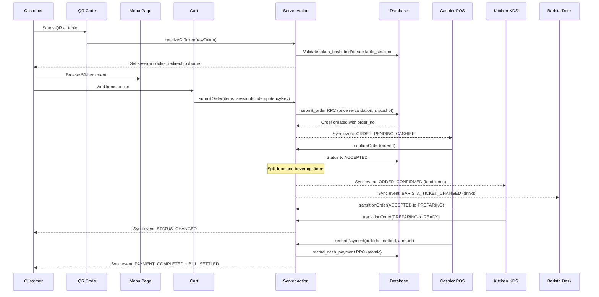

# ☕ Smol Café — Complete App Functionality & Flow Guide

> **Version:** v0.8 (Prototype)  
> **Last Updated:** 5 October 2026  
> **Location:** Rishikesh, India  
> **Stack:** Next.js 15 (App Router) · TypeScript · Tailwind CSS · Supabase (Postgres) · Razorpay

---

## 📑 Table of Contents

1. [Project Overview](#1-project-overview)
2. [Tech Stack & Architecture](#2-tech-stack--architecture)
3. [Monorepo Structure](#3-monorepo-structure)
4. [Roles & Permissions (RBAC)](#4-roles--permissions-rbac)
5. [Route Map — Every Page in the App](#5-route-map--every-page-in-the-app)
6. [Component Map](#6-component-map)
7. [Database Schema (13+ Tables)](#7-database-schema-13-tables)
8. [Complete Order Flow — End to End](#8-complete-order-flow--end-to-end)
9. [Customer Journey (QR → Menu → Order → Payment → Receipt)](#9-customer-journey)
10. [Kitchen KDS Flow](#10-kitchen-kds-flow)
11. [Barista Desk Flow](#11-barista-desk-flow)
12. [Cashier POS Flow](#12-cashier-pos-flow)
13. [Admin Tower Dashboard](#13-admin-tower-dashboard)
14. [Payment Pipeline (Cash / UPI / Razorpay)](#14-payment-pipeline)
15. [Real-Time Sync System](#15-real-time-sync-system)
16. [Authentication & Security](#16-authentication--security)
17. [Menu Management System](#17-menu-management-system)
18. [Inventory & Shelf-Life System](#18-inventory--shelf-life-system)
19. [Loyalty & Rewards Engine](#19-loyalty--rewards-engine)
20. [Community Features (Blackboard, Events, Jukebox)](#20-community-features)
21. [Procurement & Budgets](#21-procurement--budgets)
22. [Observability & Monitoring](#22-observability--monitoring)
23. [Testing & Quality Assurance](#23-testing--quality-assurance)
24. [Brand & Design System](#24-brand--design-system)
25. [Offline Resilience](#25-offline-resilience)
26. [Deployment & Infrastructure](#26-deployment--infrastructure)
27. [Key File Reference Map](#27-key-file-reference-map)

---

## 1. Project Overview

**Smol Café** is a full-stack, mobile-first **POS + Operations System** built for a real café in Rishikesh. It covers the complete café operations loop:

| What | How |
|------|-----|
| 🍽️ Digital QR Menu | Customers scan a QR code → browse a branded, 59-item catalogue on their phone |
| 🧾 Order Taking & Billing | Cashier enters orders at the counter, server recalculates totals |
| 👨‍🍳 Kitchen Order Tracking | Real-time KDS board with live status updates |
| ☕ Barista Desk | Separate beverage queue with espresso shot timers |
| 📦 Inventory Management | Track ingredients, shelf-life, expiry alerts |
| 📊 Owner Analytics | Sales trends, top sellers, revenue dashboards |
| 🎵 Jukebox & Events | Song requests, community events, daily specials blackboard |

> **Key Principle:** No online ordering in v1 — QR is menu-viewing only. Payment happens at the counter.

---

## 2. Tech Stack & Architecture

```
┌──────────────────────────────────────────────────────────┐
│                    CLIENT (Browser)                       │
│  Next.js 15 App Router · React 19 · TypeScript · Tailwind│
│  CartContext · BroadcastChannel · LocalStorage Sync       │
├──────────────────────────────────────────────────────────┤
│                  SERVER (Next.js)                         │
│  Server Components · Server Actions · API Routes          │
│  Middleware (RBAC) · Session Cookies                      │
├──────────────────────────────────────────────────────────┤
│                DATABASE (Supabase)                        │
│  PostgreSQL (ap-south-1 Mumbai) · RLS · Realtime          │
│  PL/pgSQL RPCs · Auth · Integer Paise Pricing             │
├──────────────────────────────────────────────────────────┤
│              EXTERNAL SERVICES                            │
│  Razorpay (Payments) · Sentry (Error Tracking)            │
└──────────────────────────────────────────────────────────┘
```

| Layer | Technology |
|-------|-----------|
| Frontend | React 19 + Next.js 15 (App Router) |
| Styling | Tailwind CSS + custom brand tokens |
| Language | TypeScript (strict) |
| Database | PostgreSQL via Supabase |
| Auth | Cookie-based staff sessions + Supabase Auth (customer OTP) |
| Payments | Razorpay (online) + Cash + UPI (QR) |
| Real-time | Supabase Realtime + BroadcastChannel + localStorage events |
| Fonts | EB Garamond (serif) · Inter (sans) · Noto Sans Mono · Caveat (chalk) |
| Monitoring | Sentry SDK (client + server + edge) |
| Monorepo | npm workspaces |

### Mock DB Bridge
The app includes a complete **in-memory mock database** (`lib/mock-db/`) that auto-seeds all 59 menu items, 12 tables, and supports the full PostgREST fluent query API. When `.env.local` provides real Supabase credentials, the app seamlessly switches to the live Postgres database.

---

## 3. Monorepo Structure

```
smol-cafe/
├── apps/
│   └── web/                          # Next.js 15 web application
│       ├── app/                      # App Router pages & routes
│       │   ├── [section]/[tableToken]/ # Dynamic customer entry
│       │   ├── admin/                # Admin dashboard & sub-modules
│       │   ├── api/                  # API routes (health, webhooks)
│       │   ├── barista/              # Barista drink station
│       │   ├── bill/                 # Customer running bill view
│       │   ├── cashier/              # Cashier POS interface
│       │   ├── drinks/               # Drinks menu section
│       │   ├── events/               # Community events page
│       │   ├── home/                 # Customer home page
│       │   ├── kitchen/              # Kitchen KDS board
│       │   ├── menu/                 # Customer menu browsing
│       │   ├── music/                # Jukebox / song requests
│       │   ├── order-status/         # Order tracking page
│       │   ├── orders/               # Customer orders list
│       │   ├── profile/              # Customer profile
│       │   ├── smol-backdoor/        # Staff login portal
│       │   ├── smol-menu/            # Direct menu entry (fallback)
│       │   ├── t/[tableToken]/       # QR token resolution route
│       │   └── table/                # Table service page
│       ├── components/               # 18 component directories
│       ├── context/                  # React contexts (Cart, Loading)
│       ├── hooks/                    # Custom hooks
│       ├── lib/                      # Utilities, queries, auth
│       └── middleware.ts             # Route-level RBAC guard
├── packages/
│   ├── db/                           # Database package
│   │   ├── src/schema/               # Type definitions
│   │   ├── src/migrations/           # SQL migrations
│   │   ├── seed/                     # Menu CSV seed scripts
│   │   └── supabase/                 # Supabase CLI config
│   └── ui/                           # Shared UI package (future)
├── scripts/                          # Build & utility scripts
├── prd.md                            # Product Requirements Doc
├── rules.md                          # Coding rules & conventions
├── phases.md                         # Build roadmap
├── design.md                         # Brand system spec
└── memory.md                         # Living project context
```

---

## 4. Roles & Permissions (RBAC)

### Role Matrix

| Role | Who | Cookie Value | Protected Routes | Core Permissions |
|------|-----|-------------|-----------------|-----------------|
| **Super Admin** | Owner | `admin` | `/admin/*` | Full control, analytics, budgets, user management, all staff views |
| **Admin** | Manager | `admin` | `/admin/*` | Menu CRUD, QR management, daily specials, events |
| **Cashier** | Counter Staff | `cashier` | `/cashier/*` | Order verification, cash settlement, receipts |
| **Kitchen** | Kitchen Staff | `kitchen` | `/kitchen/*` | Order queue, food prep status, cookbook |
| **Barista** | Espresso Desk | `barista` | `/barista/*` | Beverage queue, shot timer, brew status |
| **Customer** | Guest | _(no auth)_ | Public routes | Browse menu, view order status, view bill |

### How RBAC Works

```
┌─────────────────────────────────────────────────┐
│  1. Staff visits /kitchen or /cashier or /admin  │
│  2. middleware.ts checks smol_staff_session cookie│
│  3. No cookie → redirect to /smol-backdoor       │
│  4. Cookie exists → check ROLE_ROUTES mapping    │
│  5. Role has access → NextResponse.next()         │
│  6. No access → redirect to /smol-backdoor        │
└─────────────────────────────────────────────────┘
```

**Login System:** Staff logs in via **PIN code** at `/smol-backdoor`:
- Admin: PIN `9227` + Password `smol2026`
- Cashier: PIN `8112`
- Kitchen: PIN `6175`
- Barista: PIN `1234`

---

## 5. Route Map — Every Page in the App

### Customer Routes (Public — No Auth)

| Route | Purpose | Key Component |
|-------|---------|--------------|
| `/t/[tableToken]` | QR code entry point — resolves token, creates table session | `TableEntryPage` |
| `/[section]/[tableToken]` | Alternative QR entry (e.g., `/cafe/table-01`) | Delegates to `TableEntryPage` |
| `/smol-menu` | Direct menu URL (auto-assigns Table 01 if no session) | `MenuClientView` |
| `/home` | Customer home — blackboard specials, what's on, quick links | `CustomerHomeClientView` |
| `/menu` | Browse full 59-item menu with categories | `MenuClientView` |
| `/orders` | View all orders for current session | `OrderStatusClientView` |
| `/order-status` | Live order tracking with progress bar | `OrderStatusClientView` |
| `/bill` | Running bill with payment options | `RunningBillView` |
| `/drinks` | Drinks-focused menu section | Menu filtered view |
| `/music` | Jukebox — request songs, vote | `JukeboxClientView` |
| `/events` | Community events & RSVPs | `EventsClientView` |
| `/table` | Table service page | `TableClientView` |
| `/profile` | Customer profile (OTP auth) | Profile view |
| `/account` | Account management | Account view |

### Staff Routes (Protected — PIN Auth Required)

| Route | Role | Purpose | Key Component |
|-------|------|---------|--------------|
| `/smol-backdoor` | All Staff | PIN login portal | `StaffBackdoorPortal` |
| `/cashier` | Cashier | POS — verify orders, process payments | `CashierDashboard` |
| `/kitchen` | Kitchen | KDS ticket board — 4 column kanban | `KitchenBoardView` |
| `/barista` | Barista | Beverage station — drink queue + shot timer | `BaristaBoardView` |
| `/admin` | Admin | Tower dashboard — full ops overview | `AdminTowerDashboard` |
| `/admin/blackboard` | Admin | Daily specials manager | `BlackboardManager` |
| `/admin/events` | Admin | Community events CRUD | `EventsManager` |
| `/admin/music` | Admin | Jukebox DJ controller | `StaffJukeboxDj` |
| `/admin/rewards` | Admin | Loyalty rewards catalog | `RewardsManager` |
| `/admin/procurement` | Admin | Purchase orders & goods receipt | `ProcurementManager` |
| `/admin/budgets` | Admin | Budget vs actual analytics | `BudgetAnalyticsManager` |
| `/admin/observability` | Admin | Sentry logs, alerts dashboard | `ObservabilityDashboard` |
| `/admin/tables` | Admin | Table management | `TableManager` |
| `/admin/kitchen` | Admin | Kitchen menu management | `KitchenMenuManager` |

### API Routes

| Route | Method | Purpose |
|-------|--------|---------|
| `/api/health` | GET | System health check |
| `/api/webhooks/razorpay` | POST | Razorpay payment webhook (HMAC verified) |

---

## 6. Component Map

### 📁 `components/` — 18 Directories, 50+ Components

```
components/
├── account/              # Customer account views
├── admin/                # 13 components
│   ├── AdminTowerDashboard.tsx      # Main admin command center (155KB!)
│   ├── AdminMenuManager.tsx         # Menu CRUD
│   ├── TableManager.tsx             # Table CRUD (100KB)
│   ├── ProcurementManager.tsx       # PO & goods receipt
│   ├── OrderDetailsInspectorModal   # Deep order inspection
│   ├── BlackboardManager.tsx        # Daily specials
│   ├── BudgetAnalyticsManager.tsx   # Budget analytics
│   ├── EventsManager.tsx            # Events CRUD
│   ├── ObservabilityDashboard.tsx   # Monitoring
│   ├── RewardsManager.tsx           # Loyalty rewards
│   └── StaffJukeboxDj.tsx           # Music controls
├── barista/              # 3 components
│   ├── BaristaBoardView.tsx         # Barista KDS
│   ├── BaristaTicketCard.tsx        # Individual drink ticket
│   └── EspressoShotTimer.tsx        # Shot timing tool
├── bill/                 # 3 components
│   ├── RunningBillView.tsx          # Customer bill display
│   ├── DirectUpiPaymentView.tsx     # UPI QR payment
│   └── RazorpayPaymentButton.tsx    # Online payment button
├── blackboard/           # 1 component
│   └── BlackboardCard.tsx           # Chalk-style daily special card
├── cart/                 # 2 components
│   ├── CartDrawer.tsx               # Full cart interface (55KB)
│   └── FloatingCartBar.tsx          # Floating cart button
├── cashier/              # 2 components
│   ├── CashierDashboard.tsx         # Complete POS (71KB!)
│   └── CashierOrderEditorModal.tsx  # Edit orders before sending to kitchen
├── common/               # Shared utilities
├── events/               # 2 components
│   ├── EventsClientView.tsx         # Events listing
│   └── WhatsOnCard.tsx              # "What's On" home card
├── home/                 # 3 components
│   ├── CustomerHomeClientView.tsx   # Customer landing
│   ├── HomeClientHeader.tsx         # Welcome header
│   └── TodayBlackboardCard.tsx      # Today's specials widget
├── kitchen/              # 6 components
│   ├── KitchenBoardView.tsx         # Main KDS (40KB)
│   ├── KitchenCookbookView.tsx      # Recipe reference (43KB)
│   ├── KitchenMenuManager.tsx       # Kitchen-side menu (37KB)
│   ├── KitchenTicketCard.tsx        # Individual ticket
│   ├── EtaAccuracyReview.tsx        # ETA prediction audit
│   └── StaffLoginGate.tsx           # Kitchen login gate
├── menu/                 # 5 components
│   ├── MenuClientView.tsx           # Full menu browser (23KB)
│   ├── MenuItemCard.tsx             # Item card with image
│   ├── ItemDetailModal.tsx          # Item detail popup
│   ├── ItemCustomizationModal.tsx   # Customization options
│   └── CategoryNav.tsx             # Sticky category navigation
├── music/                # 1 component
│   └── JukeboxClientView.tsx        # Song request & voting
├── navigation/           # 4 components
│   ├── LayoutShell.tsx              # Root layout wrapper
│   ├── BottomNavBar.tsx             # Customer bottom nav
│   ├── AppDrawer.tsx                # Slide-out app drawer
│   └── RoleSwitcherBar.tsx          # Staff role indicator
├── orders/               # 7 components
│   ├── OrderStatusClientView.tsx    # Live order tracking (32KB)
│   ├── OrderCard.tsx                # Order summary card
│   ├── OrderReceiptModal.tsx        # Digital receipt
│   ├── OrderStatusProgress.tsx      # 5-step progress bar
│   ├── PastBillsModal.tsx           # Past bills viewer
│   ├── ConversationDeckModal.tsx    # Conversation starter prompts
│   └── AnotherRoundSuggestions.tsx  # Upsell suggestions
├── payment/              # 3 components
│   ├── DigitalReceiptModal.tsx      # PDF-ready receipt
│   ├── PostPaymentCelebrationModal  # 🎉 Thank you animation
│   └── UpiPaymentDrawer.tsx         # UPI payment flow
├── staff/                # 1 component
│   └── StaffBackdoorPortal.tsx      # Staff login portal (14KB)
└── table/                # 6 components
    ├── TableClientView.tsx          # Table service view (20KB)
    ├── TableGuestOnboardingForm.tsx  # Guest name/phone entry
    ├── TableArchedCard.tsx          # Table display card
    ├── TableActionBar.tsx           # Table actions
    ├── TableScannerModal.tsx        # QR scanner (19KB)
    └── JsonTagInspectorModal.tsx    # Debug tag inspector
```

---

## 7. Database Schema (13+ Tables)

### Core Tables

```
┌─────────────────────────────────────────────────────────────┐
│                    LOCATION LAYER                            │
│  locations ──┬── dining_tables ──── table_qr_tokens          │
│              └── table_sessions (OPEN/BILLED/CLOSED)         │
├─────────────────────────────────────────────────────────────┤
│                      MENU LAYER                              │
│  menu_categories ── menu_items ──┬── menu_item_versions      │
│                                  └── menu_prices              │
│                                      (amount_paise: integer) │
├─────────────────────────────────────────────────────────────┤
│                     ORDER LAYER                              │
│  orders ──┬── order_items (price snapshots locked!)          │
│           └── order_status_history (audit trail)             │
├─────────────────────────────────────────────────────────────┤
│                   BILLING LAYER                              │
│  bills ── payment_attempts (idempotency_key: UNIQUE)         │
│           webhook_events (provider_event_id: UNIQUE)         │
├─────────────────────────────────────────────────────────────┤
│                 INVENTORY LAYER                              │
│  inventory_movements (append-only ledger)                    │
│  recipes ── recipe_ingredients                               │
├─────────────────────────────────────────────────────────────┤
│                  LOYALTY LAYER                               │
│  profiles ── loyalty_ledger (append-only)                    │
│  rewards ── reward_redemptions                               │
├─────────────────────────────────────────────────────────────┤
│                COMMUNITY LAYER                               │
│  blackboard_posts (daily specials with scheduling)           │
│  cafe_events ── event_rsvps                                  │
│  music_sessions ── song_requests ── song_votes               │
├─────────────────────────────────────────────────────────────┤
│               PROCUREMENT LAYER                              │
│  vendors ── purchase_orders ── goods_receipts                │
│  budgets (monthly allocation tracking)                       │
└─────────────────────────────────────────────────────────────┘
```

### Key Design Decisions

| Decision | Why |
|----------|-----|
| **Integer paise** (`amount_paise`) instead of float rupees | No floating-point rounding errors in money calculations |
| **Immutable price snapshots** in `order_items` | A past receipt never changes when menu prices are updated |
| **Idempotency keys** on payment attempts | Double-tap on "Pay" button never creates duplicate charges |
| **Append-only ledger** for loyalty | Balance always derivable from history; no phantom points |
| **`order_no`** sequential per location | Human-readable ticket numbers (Order #47, not UUIDs) |

### Order Status Enum

```
DRAFT → PENDING_CONFIRMATION → SUBMITTED → ACCEPTED → PREPARING → READY → SERVED → CANCELLED → REJECTED
```

### Table Session Status

```
OPEN → BILLED → CLOSED
```

### Payment Status

```
PENDING → AUTHORIZED → CAPTURED → FAILED → REFUNDED
```

---

## 8. Complete Order Flow — End to End



### Step-by-Step Breakdown

| Step | Actor | Action | Tech Detail |
|------|-------|--------|-------------|
| 1 | Customer | Scans QR code at table | `/t/[tableToken]` route |
| 2 | Server | Resolves token → SHA-256 hash → DB lookup | `resolveQrToken()` server action |
| 3 | Server | Creates/finds OPEN `table_session` | Sets signed session cookie |
| 4 | Customer | Browses menu, adds items | `CartContext` (client state) |
| 5 | Customer | Submits order | `submitOrder()` server action |
| 6 | Server | **Re-validates prices server-side** | Prevents stale price charges |
| 7 | Server | Creates order with **price snapshots** | `order_items.unit_price_snapshot` |
| 8 | Server | Assigns sequential `order_no` | Locked counter per location |
| 9 | Cashier | Sees new order, verifies, confirms | `/cashier` dashboard |
| 10 | Cashier | Can edit order items before confirming | `CashierOrderEditorModal` |
| 11 | Server | Splits into food & beverage tickets | `isBeverageItem()` utility |
| 12 | Kitchen | Receives food ticket | KDS 4-column board |
| 13 | Barista | Receives drink ticket | Barista board |
| 14 | Kitchen | Updates: Accepted → Preparing → Ready | Big-tap status buttons |
| 15 | Customer | Sees live status updates | 4-second polling + sync events |
| 16 | Cashier | Processes payment (Cash/UPI/Card) | `recordPayment()` server action |
| 17 | Server | Closes bill, generates receipt | Atomic `record_cash_payment` RPC |
| 18 | Customer | Views digital receipt | `DigitalReceiptModal` |
| 19 | Analytics | Data flows to admin dashboards | Automatic from order/payment tables |

---

## 9. Customer Journey

### 9.1 QR Entry Flow

```
Customer scans QR → /t/table-05
                     ↓
            resolveQrToken("table-05")
                     ↓
            ┌─ Hash token with SHA-256
            ├─ Look up table_qr_tokens
            ├─ Validate: not revoked, table active
            ├─ Find/create OPEN table_session
            └─ Set smol_table_session cookie
                     ↓
            Redirect to /home (customer landing)
```

### 9.2 Menu Browsing

- **13 categories** with sticky horizontal navigation
- **59 menu items** with photos, descriptions, dietary badges (Veg/Non-Veg/Vegan)
- **Item Detail Modal** with:
  - Full description
  - Price in ₹ (derived from paise)
  - Pairing suggestions from metadata
  - Customization options
  - Add to cart button
- **Sold Out** items clearly marked and non-orderable

### 9.3 Cart System

| Feature | Implementation |
|---------|---------------|
| State Management | `CartContext.tsx` — React Context + `useState` |
| Item Operations | `addItem()`, `updateQty()`, `setQty()`, `removeItem()`, `clearCart()` |
| Price Calculation | `subtotalPaise` computed from `item.pricePaise × qty` |
| UI | `CartDrawer.tsx` (55KB full-featured drawer) + `FloatingCartBar.tsx` |
| Persistence | Client-side only (intentional — prices re-validated on submit) |

### 9.4 Order Submission

```typescript
// Server Action: submitOrder()
1. Validate table_session exists and is OPEN
2. Generate idempotency_key (prevents double-submit)
3. Re-fetch current menu_prices from DB
4. Compare client prices vs server prices → reject if mismatch
5. Create order with status PENDING_CONFIRMATION
6. Create order_items with unit_price_snapshot (locked forever)
7. Assign sequential order_no
8. Broadcast sync event: ORDER_PENDING_CASHIER
```

### 9.5 Order Status Tracking

The customer sees a **5-step progress bar**:

```
 Submitted → Accepted → Preparing → Ready → Served
    ○           ○           ○          ○        ○
```

- **4-second polling** for status updates
- **Real-time sync events** for instant updates (BroadcastChannel + Supabase)
- **Plain-language brand copy** (warm, smol café voice)

### 9.6 Bill & Payment

- Running bill at `/bill` shows all session orders
- Payment methods: Cash (at counter), UPI (QR scan), Razorpay (online)
- After payment → `PostPaymentCelebrationModal` 🎉
- Digital receipt available → `DigitalReceiptModal`

---

## 10. Kitchen KDS Flow

### Board Layout (4-Column Kanban)

```
┌──────────┬──────────┬──────────┬──────────┐
│ ACCEPTED │ PREPARING│  READY   │  SERVED  │
│   (New)  │ (Active) │ (Done)   │ (Closed) │
├──────────┼──────────┼──────────┼──────────┤
│ Order #47│ Order #45│ Order #43│ Order #40│
│ Table 05 │ Table 02 │ Table 08 │ Table 01 │
│ 2 items  │ 3 items  │ 1 item   │ 4 items  │
│ [START]  │ [READY]  │ [SERVED] │  ✓ Done  │
│          │          │          │          │
│ ⏱️ 2m    │ ⏱️ 8m    │ ⏱️ 12m   │          │
└──────────┴──────────┴──────────┴──────────┘
```

### Key Features

| Feature | Detail |
|---------|--------|
| **3-second polling** | Auto-refreshes ticket list |
| **Urgency timers** | Color-coded: <5m green, 5-10m yellow, >10m red |
| **44px+ tap targets** | Kitchen-safe — hands may be wet/busy |
| **Concurrency-safe transitions** | `STATUS_MISMATCH` error if ticket already moved by another cook |
| **Audit history** | Every status change logged with timestamp and actor |
| **Food-only tickets** | Beverages routed separately to barista desk |
| **Cookbook view** | Recipe reference for each menu item (`KitchenCookbookView`) |
| **ETA Engine** | Station bottleneck formula + 120s buffer, honest ranges (10–14 min) |

### Kitchen Server Actions

```typescript
// apps/web/app/kitchen/actions.ts
fetchKitchenOrdersAction()     // Get all active kitchen tickets
fetchSingleKitchenTicketAction() // Fast single ticket fetch (15ms)
transitionOrderAction()         // Move ticket to next status
```

---

## 11. Barista Desk Flow

Separate from kitchen — handles **beverages only**.

### Components

| Component | Size | Purpose |
|-----------|------|---------|
| `BaristaBoardView.tsx` | 32KB | Main barista KDS board |
| `BaristaTicketCard.tsx` | 8KB | Individual drink ticket |
| `EspressoShotTimer.tsx` | 4KB | Shot timing tool (25-30s targets) |

### How Items Route to Barista

```typescript
// isBeverageItem() in lib/station-utils.ts
// Checks item name & category for drink keywords:
// "coffee", "tea", "brew", "latte", "espresso", "beverage", etc.
```

When cashier confirms an order:
- **Food items** → Kitchen KDS
- **Beverage items** → Barista Desk
- **Mixed orders** → Both stations get their respective items

---

## 12. Cashier POS Flow

### `CashierDashboard.tsx` (71KB — Largest Component!)

The cashier dashboard is the **nerve center** of the café:

```
┌─────────────────────────────────────────┐
│          CASHIER POS DASHBOARD          │
├─────────────────────────────────────────┤
│ ┌───────────────┐  ┌─────────────────┐  │
│ │ PENDING ORDERS│  │ CONFIRMED ORDERS│  │
│ │               │  │                 │  │
│ │ Order #48     │  │ Order #47       │  │
│ │ Table 03      │  │ Table 05        │  │
│ │ ₹450          │  │ ₹320 ✓ Paid    │  │
│ │ [CONFIRM]     │  │ [RECEIPT]       │  │
│ │ [EDIT] [❌]   │  │                 │  │
│ └───────────────┘  └─────────────────┘  │
│                                         │
│ ┌─────────────────────────────────────┐ │
│ │ PAYMENT SECTION                     │ │
│ │ [💵 Cash] [📱 UPI] [💳 Razorpay]   │ │
│ │ Tender: ₹500  Change: ₹50          │ │
│ └─────────────────────────────────────┘ │
└─────────────────────────────────────────┘
```

### Cashier Capabilities

| Feature | Server Action | Detail |
|---------|--------------|--------|
| View pending orders | `fetchPendingOrdersAction()` | Orders awaiting confirmation |
| Confirm order | `confirmOrderAction()` | Sends to kitchen/barista |
| Reject order | `rejectOrderAction()` | Cancels with reason |
| Edit order | `CashierOrderEditorModal` | Add/remove items before confirming |
| Process cash payment | `recordCashPaymentAction()` | Tender/change calculator |
| Process UPI payment | `UpiPaymentDrawer` | Generate UPI QR |
| Process Razorpay | `RazorpayPaymentButton` | Online card/netbanking |
| Generate receipt | `DigitalReceiptModal` | Printable receipt |
| View today's orders | Dashboard list | All orders for current day |

### Cashier Server Actions (28KB — `cashier/actions.ts`)

```typescript
fetchPendingOrdersAction()         // All pending orders
fetchAllMenuItemsForCashierAction() // Menu catalog for order editing
confirmOrderAction()                // Confirm → send to kitchen
rejectOrderAction()                 // Reject with reason
recordCashPaymentAction()           // Cash settlement
// + many more...
```

---

## 13. Admin Tower Dashboard

### `AdminTowerDashboard.tsx` (155KB — Monster Component!)

The admin's **command center** with everything at a glance:

### Dashboard Sections

| Section | What It Shows |
|---------|---------------|
| **KPI Cards** | Today's orders, gross revenue, active tables, pending KDS, avg order value, top seller |
| **Hourly Chart** | Orders per hour bar chart |
| **Best Sellers** | Top items by units sold, revenue %, visualization |
| **Live Orders** | Full order list with inspector modal |
| **Payment Log** | All transactions (Cash/UPI/Card), amounts, timestamps |
| **Table Map** | Visual grid of all 12 tables, session status |

### Admin Sub-Modules

| Route | Component | Purpose |
|-------|-----------|---------|
| `/admin/blackboard` | `BlackboardManager` | Create/schedule daily specials with start/end times |
| `/admin/events` | `EventsManager` | Community events with capacity tracking & RSVPs |
| `/admin/music` | `StaffJukeboxDj` | Approve/reject song requests, manage queue |
| `/admin/rewards` | `RewardsManager` | Create loyalty rewards, set point costs |
| `/admin/procurement` | `ProcurementManager` | Vendors, purchase orders, goods receipt notes |
| `/admin/budgets` | `BudgetAnalyticsManager` | Monthly budgets, actual vs planned spend |
| `/admin/observability` | `ObservabilityDashboard` | Sentry errors, structured logs, alerts |
| `/admin/tables` | `TableManager` | CRUD tables, generate QR codes, manage zones |
| `/admin/kitchen` | `KitchenMenuManager` | Kitchen-side menu status, availability |

### Admin Server Actions (18KB — `admin/actions.ts`)

```typescript
fetchAdminOverviewAction()    // KPI aggregation
fetchAdminOrdersAction()      // Full order list
fetchAdminPaymentsAction()    // Payment log
fetchAdminStatsAction()       // Hourly + best sellers
fetchMenuItemsAction()        // Menu for admin editing
toggleItemSoldOutAction()     // Quick sold-out toggle
```

---

## 14. Payment Pipeline

### Three Payment Methods

```
┌─────────────────────────────────────────────┐
│               PAYMENT FLOW                   │
├─────────┬──────────┬────────────────────────┤
│ 💵 CASH  │ 📱 UPI   │ 💳 RAZORPAY (Online)   │
├─────────┼──────────┼────────────────────────┤
│ Cashier │ Customer │ Customer               │
│ enters  │ scans QR │ clicks Pay button      │
│ tender  │ pays via │ Razorpay checkout      │
│ amount  │ PhonePe/ │ opens                  │
│         │ GPay     │                        │
│ Change  │          │ HMAC verification      │
│ calc'd  │ Manual   │ Server-side            │
│         │ confirm  │                        │
│ record_ │          │ Webhook endpoint       │
│ cash_   │          │ /api/webhooks/razorpay  │
│ payment │          │                        │
│ RPC     │          │ Dedupe via             │
│         │          │ provider_event_id      │
└─────────┴──────────┴────────────────────────┘
```

### Cash Payment

```typescript
// recordCashPaymentAction()
1. Validate order exists and is payable
2. Create bill if not exists
3. Record payment_attempt with idempotency_key
4. Calculate change (tender - total)
5. Update bill status → PAID
6. Close table_session if all orders paid
7. Broadcast BILL_SETTLED + PAYMENT_COMPLETED sync events
```

### Razorpay Online Payment

```
1. Client creates Razorpay order → PENDING payment_attempt logged
2. Customer completes Razorpay checkout
3. Client receives payment response
4. Server verifies HMAC-SHA256 signature (constant-time comparison)
5. Payment captured → payment_attempt → CAPTURED
6. Razorpay Webhook → /api/webhooks/razorpay
   └─ Deduplicated by provider_event_id (UNIQUE constraint)
   └─ Out-of-order safety: AUTHORIZED → CAPTURED state guard
```

### UPI Payment

```
1. Generate UPI deep link with amount
2. Display QR code for customer to scan
3. Customer pays via PhonePe/GPay/etc.
4. Cashier manually confirms payment received
5. Record payment in system
```

---

## 15. Real-Time Sync System

### `lib/sync-events.ts` — Triple-Layer Sync

The app uses **3 parallel sync channels** for zero-latency cross-view communication:

```
┌──────────────────────────────────────────────┐
│           SYNC EVENT FLOW                     │
│                                               │
│  Order placed by Customer                     │
│         ↓                                     │
│  broadcastSyncEvent({ type: "ORDER_PLACED" }) │
│         ↓                                     │
│  ┌─ 1. Local listeners (0ms)                  │
│  ├─ 2. BroadcastChannel (0ms, same origin)    │
│  ├─ 3. localStorage event (cross-tab)         │
│  └─ 4. Supabase Realtime (cross-device)       │
│         ↓                                     │
│  Kitchen KDS auto-refreshes                   │
│  Cashier sees new order                       │
│  Admin dashboard updates                      │
└──────────────────────────────────────────────┘
```

### Sync Event Types

| Event | Trigger | Who Listens |
|-------|---------|-------------|
| `ORDER_PLACED` | Customer submits order | Cashier, Kitchen |
| `ORDER_CONFIRMED` | Cashier confirms | Kitchen, Barista, Customer |
| `ORDER_REJECTED` | Cashier rejects | Customer |
| `ORDER_PENDING_CASHIER` | New order awaiting cashier | Cashier |
| `STATUS_CHANGED` | Kitchen updates status | Customer, Cashier |
| `TICKET_STATUS_CHANGED` | KDS ticket moved | All views |
| `BARISTA_TICKET_CHANGED` | Barista updates | Cashier, Customer |
| `ITEM_AVAILABILITY_CHANGED` | Menu item stock change | All menu views |
| `BILL_SETTLED` | Payment complete | Customer, Admin |
| `PAYMENT_COMPLETED` | Payment recorded | Customer, Admin |
| `TABLE_RENAMED` / `TABLE_CREATED` / `TABLE_DELETED` | Admin table ops | All table views |
| `INVENTORY_UPDATED` | Stock change | Kitchen, Admin |
| `SETTINGS_UPDATED` | Config change | All views |

### Supabase CDC (Change Data Capture)

In addition to manual sync events, the system subscribes to **Postgres real-time changes**:

```typescript
// Automatic CDC on 'orders' table
channel.on("postgres_changes", { event: "*", schema: "public", table: "orders" }, ...)

// Automatic CDC on 'menu_items' table
channel.on("postgres_changes", { event: "*", schema: "public", table: "menu_items" }, ...)
```

---

## 16. Authentication & Security

### Staff Authentication

| Layer | Implementation |
|-------|---------------|
| **Cookie** | `smol_staff_session` — stores role string (e.g., "kitchen") |
| **Middleware** | `middleware.ts` — checks cookie before allowing access to protected routes |
| **Server Actions** | Each action validates staff session before executing |
| **POST bypass** | Server Actions and API POSTs bypass middleware redirect (return proper error responses instead) |

### Customer Sessions

| Layer | Implementation |
|-------|---------------|
| **QR Token** | Raw token → SHA-256 hash → DB lookup |
| **Session Cookie** | `smol_table_session` — contains sessionId, tableId, tableLabel, locationName |
| **No login required** | Anonymous ordering — zero friction for guests |
| **Optional accounts** | Supabase OTP auth for profile/loyalty features |
| **24h Order Claiming** | `claim_session_orders` RPC — link past orders to new profile |

### Database Security (RLS)

- **Deny-by-default** on all tables
- Customer scoped by `table_session_id` claim
- Staff scoped by role (admin, cashier, kitchen, chef)
- Server-side admin client bypasses RLS for trusted operations

### Anti-Abuse Measures

| Measure | Where |
|---------|-------|
| Idempotency keys | Order submission, payment attempts |
| Server-side price re-validation | Order submission |
| HMAC SHA-256 verification | Razorpay webhooks |
| Webhook event deduplication | `provider_event_id` UNIQUE constraint |
| Rate limiting (music) | 15-minute cooldown on song requests |
| Vote deduplication | 1 vote per table per song |

---

## 17. Menu Management System

### Menu Architecture

```
menu_categories (13)
    └── menu_items (59)
            ├── menu_item_versions (descriptions, images, metadata)
            └── menu_prices (amount_paise, effective_from/to)
```

### 13 Categories (from V0.8 Workbook)

The real smol café menu includes categories like:
- All-Day Breakfasts
- Comfort Bowls
- Light Bites & Salads
- Sandwiches & Toasts
- Artisanal Coffees
- Teas & Infusions
- Smoothies & Juices
- Sweet Treats
- And more...

### Admin Menu Operations

| Action | Component | Detail |
|--------|-----------|--------|
| Edit item name/description | `AdminMenuManager` | Live updates |
| Change price | Admin dashboard | Creates new `menu_price` row (historical accuracy) |
| Toggle sold out | Admin/Kitchen | `toggleItemSoldOutAction()` |
| Add/remove items | Admin CRUD | Full category management |
| View servable quantity | Kitchen menu | Based on inventory recipes |

### Key Rule: Historical Price Accuracy

> **Once an order's receipt is generated, that order's line items and prices are LOCKED.** A later menu price change **never** rewrites a past receipt.

This is enforced by `order_items.unit_price_snapshot` — a point-in-time copy of the price at order time.

---

## 18. Inventory & Shelf-Life System

### Architecture

```
inventory_movements (append-only ledger)
    ├── type: RECEIVE | RESERVE | CONSUME | RELEASE | WASTE | ADJUST
    ├── qty: positive or negative
    └── linked to: order_id, purchase_order_id, etc.

recipes
    └── recipe_ingredients (what ingredients make each menu item)

servable_qty() — how many portions can be made from current stock
```

### Inventory Flow

```
Goods Received → RECEIVE movement → stock increases
    ↓
Order Submitted → RESERVE movement → stock reserved
    ↓
Kitchen starts prep → CONSUME movement → stock consumed
    ↓
Order cancelled → RELEASE movement → stock returned
    ↓
Waste logged → WASTE movement → stock decreased
```

### Shelf-Life Tracking

- Each inventory item shows **days until expiry**
- Color-coded: 🟢 Fresh | 🟡 Expiring Soon | 🔴 Expired
- Low-stock and expiring-soon **alerts** for the chef

### Manual 86 Engine

Kitchen staff can **86 an item** (mark as unavailable) regardless of calculated stock. The 86 flag takes **precedence** over `servable_qty()`.

---

## 19. Loyalty & Rewards Engine

### How It Works

```
Customer pays → EARN points (loyalty_ledger row)
    ↓
Points accumulate in current_balance_cached
    ↓
Customer redeems reward → REDEEM from catalog
    ↓
Refund issued → automatic REVERSAL of earned points
```

### Database Tables

| Table | Purpose |
|-------|---------|
| `profiles` | Customer accounts (phone-based OTP) |
| `loyalty_ledger` | Append-only: EARN, REDEEM, REVERSAL, ADJUSTMENT |
| `rewards` | Reward catalog (point costs, descriptions) |
| `reward_redemptions` | Tracking which rewards were claimed |

### Key RPCs

```sql
record_loyalty_movement()   -- Atomic ledger + balance update
claim_session_orders()      -- Link anonymous orders to profile (24h window)
```

---

## 20. Community Features

### 20.1 Blackboard Daily Specials

```
Admin creates special → blackboard_posts table
    ├── title, description
    ├── starts_at, ends_at (time scheduling)
    └── chalk-aesthetic UI (Caveat font)

Customer sees → TodayBlackboardCard on /home
```

### 20.2 Community Events ("What's On")

```
Admin creates event → cafe_events table
    ├── name, description, date
    ├── capacity tracking
    └── cover_image

Customer RSVPs → event_rsvps table
    └── 1-tap interest registration

Home page → WhatsOnCard widget
```

### 20.3 Jukebox 🎵

```
Customer requests song → song_requests table
    ├── song name, artist
    └── 15-minute rate limit per table

Other customers vote → song_votes table
    └── 1 vote per table per song (dedupe)

Staff DJ → StaffJukeboxDj component
    └── Approve/reject/play queue management

Music sessions → music_sessions table
    └── Active session tracking
```

---

## 21. Procurement & Budgets

### Procurement Flow

```
Admin creates Vendor → vendors table
    ↓
Admin creates Purchase Order → purchase_orders table
    ├── items, quantities, unit prices
    └── status: DRAFT → SUBMITTED → RECEIVED
    ↓
Admin records Goods Receipt → goods_receipts table
    └── Atomic RECEIVE movement → stock increases
```

> **Important:** PO creation **never** touches stock. Only the Goods Receipt Note (GRN) creates inventory movements.

### Budget Analytics

```
budgets table
    ├── month, category
    ├── allocated_amount
    └── Compare with actual spend from GRNs

BudgetAnalyticsManager shows:
    ├── Budget vs Actual per category
    ├── Supplier audit & price trends
    └── Monthly drill-down
```

---

## 22. Observability & Monitoring

### Sentry Integration

```
sentry.client.config.ts   # Browser error tracking
sentry.server.config.ts   # Server-side error tracking
sentry.edge.config.ts     # Edge runtime tracking
```

### Structured Logging

```typescript
// lib/observability/logger.ts
logger.info("Order created", {
    requestId: "req_abc123",
    orderId: "ord_xyz",
    // Secrets & OTPs auto-redacted
});
```

### Alert Engine

```
3 Alert Rules with webhook dispatch:
1. KDS Silence Alert (no heartbeat for 10+ minutes)
2. Payment failure spike
3. Error rate threshold
```

### Admin Dashboard

`/admin/observability` → `ObservabilityDashboard.tsx`:
- Recent Sentry errors
- Structured log viewer
- Alert history
- System health status

---

## 23. Testing & Quality Assurance

### Test Suites

| Command | Tests | What It Validates |
|---------|-------|------------------|
| `npm run test:invariants` | 7 tests | Idempotency, price 409 diffs, stock races, KDS double-tap, webhook dedupe, monotonic state, price immutability |
| `npm run test:refunds` | Multiple | Partial & full Razorpay refunds, bill status transitions, loyalty point reversal |
| `npm run test:rbac` | 8 scenarios | Unauthorized roles blocked across 8 permission boundaries |

### Automated Checks

- ✅ TypeScript typecheck (strict mode)
- ✅ ESLint
- ✅ Prettier formatting
- ✅ Production build validation
- ✅ Disaster recovery restore drill (100% PASS, completed in 2m45s)

---

## 24. Brand & Design System

### Color Palette

| Token | Hex | Usage |
|-------|-----|-------|
| Café Crème | `#F3E7D3` | Primary background (day) |
| Espresso Ink | `#241F1C` | Primary text (day) / Background (night) |
| Smol Cherry | `#B72E35` | Accent, CTAs, highlights |
| Night BG | `#151110` | Dark mode background |

### Typography

| Font | Variable | Usage |
|------|----------|-------|
| EB Garamond | `--font-serif` | Headings, brand moments |
| Inter | `--font-sans` | Body text, UI elements |
| Noto Sans Mono | `--font-mono` | Prices, order numbers |
| Caveat | `--font-chalk` | Blackboard specials |

### Day/Night Auto Theme

```javascript
// Automatic based on IST time:
// 6:00 PM (18:00) to 4:00 AM (04:00) → Night mode
// 4:00 AM (04:00) to 6:00 PM (18:00) → Day mode
// User can override via localStorage ('smol_theme')
```

### Design Principles

- **Mobile-first** — every view designed for phone screens first
- **Warm, low-pressure voice** — brand copy is friendly, never corporate
- **44px+ tap targets** — kitchen-safe, wet hands friendly
- **Day/Night duality** — café transforms from daytime warmth to evening ambiance

---

## 25. Offline Resilience

### Offline Queue

```typescript
// lib/offline-queue.ts (7.5KB)
// Queues failed network requests for retry when connection returns
```

### Offline Cache

```typescript
// lib/offline-cache.ts (2.3KB)
// Caches critical data locally for offline viewing
```

### Network Health Hook

```typescript
// hooks/useNetworkHealth.ts (3.8KB)
// Monitors connection status, shows offline banner
```

### Graceful Degradation

- Customer can still browse cached menu offline
- Orders queue locally and submit when back online
- Cart state preserved in client memory
- Banner notification when offline

---

## 26. Deployment & Infrastructure

### Current Setup

| Component | Service |
|-----------|---------|
| Hosting | Vercel (planned) |
| Database | Supabase PostgreSQL (ap-south-1 Mumbai) |
| Payments | Razorpay |
| Error Tracking | Sentry |
| Domain | TBD |

### Environment Variables

```env
# Supabase
NEXT_PUBLIC_SUPABASE_URL=
NEXT_PUBLIC_SUPABASE_ANON_KEY=
SUPABASE_SERVICE_ROLE_KEY=

# Razorpay
NEXT_PUBLIC_RAZORPAY_KEY_ID=
RAZORPAY_KEY_SECRET=
RAZORPAY_WEBHOOK_SECRET=

# Sentry
NEXT_PUBLIC_SENTRY_DSN=
SENTRY_AUTH_TOKEN=
```

### Build Commands

```bash
npm run dev          # Local development server
npm run build        # Production build
npm run start        # Start production server
npm run lint         # ESLint
npm run typecheck    # TypeScript check
npm run format       # Prettier format
npm run db:types     # Generate Supabase types
npm run db:push      # Push migrations
npm run db:seed:apply # Seed menu data
```

### PWA Support

```typescript
// app/manifest.ts — Web App Manifest
{
  name: "smol café",
  short_name: "smol café",
  start_url: "/",
  display: "standalone",
  theme_color: "#F3E7D3",
  background_color: "#F3E7D3"
}
```

---

## 27. Key File Reference Map

### Server Actions (Business Logic)

| File | Size | Responsibility |
|------|------|---------------|
| `cashier/actions.ts` | 28KB | Order verification, payment processing |
| `admin/actions.ts` | 18KB | Dashboard KPIs, order/payment queries |
| `kitchen/actions.ts` | 16KB | KDS ticket management, status transitions |
| `t/actions.ts` | 15KB | QR token resolution, session management |
| `admin/menu-actions.ts` | 11KB | Menu CRUD operations |
| `kitchen/menu-actions.ts` | 11KB | Kitchen-side menu management |
| `smol-backdoor/actions.ts` | 8KB | Staff login/logout |

### Library / Utilities

| File | Size | Responsibility |
|------|------|---------------|
| `lib/sync-events.ts` | 8KB | Cross-view real-time sync (3 channels) |
| `lib/print.ts` | 9KB | Receipt printing |
| `lib/offline-queue.ts` | 7.5KB | Offline request queuing |
| `lib/customer-phone.ts` | 7KB | Customer phone utilities |
| `lib/sound.ts` | 7KB | Audio notifications |
| `lib/food-images.ts` | 12KB | Menu item image mappings |
| `lib/queries/menu.ts` | 10KB | Menu data queries |
| `lib/razorpay.ts` | 4KB | Razorpay client utilities |
| `lib/upi.ts` | 4KB | UPI payment utilities |
| `lib/session.ts` | 4KB | Session cookie management |

### Config & Infrastructure

| File | Purpose |
|------|---------|
| `middleware.ts` | Route-level RBAC guard |
| `layout.tsx` | Root layout, fonts, theme |
| `tailwind.config.ts` | Brand tokens, custom theme |
| `globals.css` | Global styles |
| `context/CartContext.tsx` | Cart state management |

### Database Package

| File | Purpose |
|------|---------|
| `packages/db/src/types.ts` | Full Supabase type definitions |
| `packages/db/src/schema/` | Table/enum type exports |
| `packages/db/src/migrations/` | SQL migration files |
| `packages/db/seed/` | Menu CSV seed data |

### Mock Database

| File | Size | Purpose |
|------|------|---------|
| `lib/mock-db/index.ts` | 39KB | Full PostgREST adapter |
| `lib/mock-db/seedData.ts` | 53KB | Auto-seed data (59 items, 12 tables) |

---

## 📊 App Size Summary

| Metric | Count |
|--------|-------|
| Total Routes | 20+ pages |
| Total Components | 50+ |
| Server Actions Files | 7 |
| Database Tables | 22+ |
| Menu Categories | 13 |
| Menu Items | 59 |
| Dining Tables | 12 |
| Test Suites | 3 (invariants, refunds, RBAC) |
| Sync Event Types | 16 |
| Component Code | ~1MB+ TypeScript |

---

## 🏗️ Current Status & Next Steps

### ✅ What's Built (Production-Ready UI Prototype)

- [x] All 6 roles fully functional
- [x] Complete QR → Menu → Cart → Order → Kitchen → Payment flow
- [x] Cashier POS with order editing
- [x] Kitchen KDS with 4-column kanban
- [x] Barista desk with shot timer
- [x] Admin tower with analytics
- [x] Razorpay + Cash + UPI payments
- [x] Real-time sync across all views
- [x] Loyalty & rewards engine
- [x] Blackboard, events, jukebox
- [x] Procurement & budgets
- [x] Observability (Sentry + structured logging)
- [x] 100% PASS on all automated tests
- [x] Mock DB for zero-setup local development

### 🔜 What's Next

1. **Production deployment** to Vercel with live Supabase
2. **Thermal printer integration** for KOT/receipts
3. **SMS/WhatsApp notifications** for table calls & digital receipts
4. **Multi-branch support** (future scaling)

---

> _"just a smol café, doing smol things, one cup at a time."_ ☕
